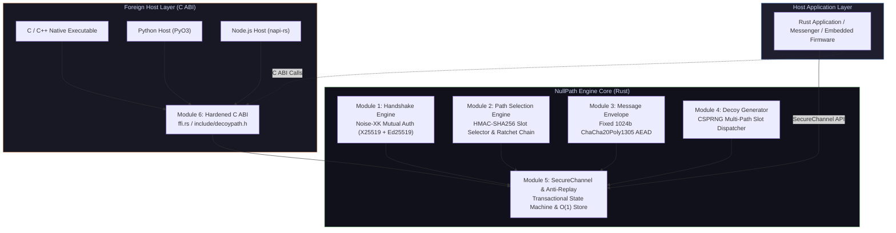
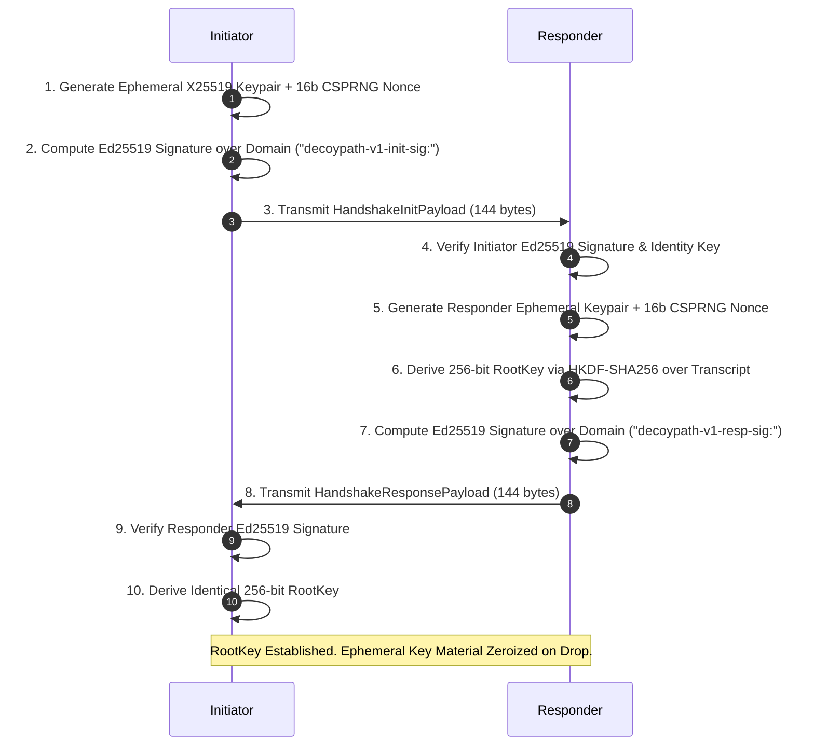
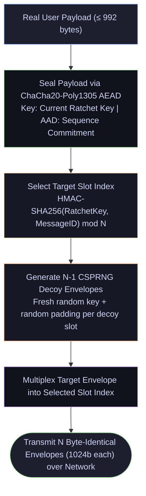
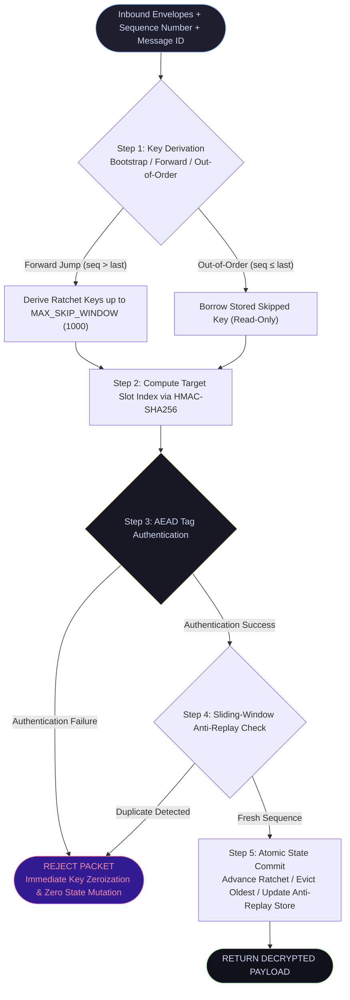

<div align="center">

```
   _  ___  ____    __    ___  ___ _____ _   _ 
  | \| | || |  |  |  |  | _ \/ _ \_   _| | | |
  | .` | || |  |__|  |__|  _/ ___ \| | | |_| |
  |_|\_|\___|____|____|____|_|   |_|_|  \___/ 
                                              
```

### ⚡ NULLPATH ⚡
**Next-Generation Zero-Trust, Multi-Path Obfuscated Secure Protocol Engine**

*Traffic-Analysis Resistant · Constant-Size Envelopes · Transactional Zero-Mutation State Machine*

---

[](https://www.rust-lang.org)
[](LICENSE)
[](#)
[](#security-architecture)
[](#license)

[Overview](#-overview) ·
[Comparative Matrix](#-protocol-comparative-matrix) ·
[Architecture](#-system-architecture) ·
[Protocol Lifecycle](#-protocol-lifecycle) ·
[Security State Machine](#-transactional-zero-mutation-state-machine) ·
[Usage](#-quickstart--usage) ·
[C ABI Bindings](#-c-abi--foreign-language-bindings)

---

</div>

## 🌌 Overview

Modern secure channels (TLS 1.3, Noise Protocol, Signal) protect **content confidentiality**, but leave **traffic metadata** exposed. Passive adversaries observing encrypted connections can infer communication presence, packet sizes, transmission intervals, and burst patterns — unmasking users and infrastructure without ever breaking a single cipher.

**`NullPath`** is a high-performance cryptographic engine engineered in Rust to neutralize side-channel metadata analysis at the application layer.

```
       WITHOUT NULLPATH (Metadata Leakage)              WITH NULLPATH (Complete Obfuscation)
  ┌────────────────────────────────────────┐     ┌────────────────────────────────────────┐
  │ [User] ──( 128b )────────────────> [A] │     │ [User] ──( 1024b Real Envelope )─> [A] │
  │ [User] ──( 512b )────────────────> [B] │     │ [User] ──( 1024b Decoy Envelope)─> [B] │
  │ (Observer sees size/timing/targets)    │     │ [User] ──( 1024b Decoy Envelope)─> [C] │
  └────────────────────────────────────────┘     │ (Observer sees N identical envelopes)  │
                                                 └────────────────────────────────────────┘
```

### 🔮 Core Security Invariants

- 🎭 **Metadata Uniformity**: Every transmission generates $N$ byte-identical 1024-byte envelopes. Real payloads are multiplexed alongside CSPRNG decoy envelopes encrypted under ephemeral keys.
- 🔁 **Single-Use Forward Ratchet**: Keys are derived on-demand via single-use hash ratchets (`decoypath-v1-ratchet:`) and zeroized upon consumption. Past sessions remain inviolable.
- ⚡ **Transactional Zero-Mutation**: Forged, corrupt, or out-of-order packets fail authentication in constant time before committing any state mutation.
- 🧩 **Bounded Memory Execution**: $O(\log N)$ min-key eviction (`BTreeMap`) for skipped ratchet keys (`MAX_SKIPPED_KEYS = 1000`) and $O(1)$ amortized sliding-window anti-replay store (`10,000` capacity, 300s window).
- 🌉 **Hardened Foreign ABI**: Standard C ABI bindings wrapped in `std::panic::catch_unwind` with strict buffer capacity verification and stack/heap memory zeroization.

---

## 📊 Protocol Comparative Matrix

| Security & Architectural Feature | `NullPath` | **TLS 1.3** | **Noise Protocol** | **Signal Protocol** | **Tor / Mixnet** |
|:---------------------------------|:----------:|:-----------:|:------------------:|:-------------------:|:----------------:|
| **Payload Content Confidentiality** | ✅ AEAD | ✅ AEAD | ✅ AEAD | ✅ AEAD | ✅ Onion AEAD |
| **Payload Size Masking** | ✅ Constant (1024b) | ❌ Dynamic | ❌ Dynamic | ❌ Dynamic | ⚠️ Fixed Cells |
| **Decoy Traffic Multiplexing** | ✅ Multi-Path CSPRNG | ❌ None | ❌ None | ❌ None | ⚠️ Cover Traffic |
| **Traffic Metadata Obfuscation** | ✅ Application Layer | ❌ None | ❌ None | ❌ None | ✅ Routing Layer |
| **Single-Use Key Forward Secrecy** | ✅ Hash Ratchet | ✅ Ephemeral DH | ✅ Ephemeral DH | ✅ Double Ratchet | ✅ Circuit Keys |
| **Zero-Mutation Forgery Rejection** | ✅ 5-Step Transactional | ❌ Connection Reset | ❌ Session Fail | ❌ MAC Failure | ❌ Cell Drop |
| **Out-of-Order Packet Processing** | ✅ Bounded Sliding | ❌ Sequential Only | ❌ Sequential Only | ✅ Out-of-Order | ❌ Sequential |
| **Constant-Time Decoy Rejection** | ✅ Equal Time | ❌ N/A | ❌ N/A | ❌ N/A | ⚠️ Variable |
| **C ABI Foreign Embeddability** | ✅ Hardened C ABI | ⚠️ OpenSSL / C | ⚠️ Native C | ⚠️ libsignal | ⚠️ C / Rust Lib |

---

## 🏗️ System Architecture



---

## 🔄 Protocol Lifecycle

### 1. Handshake Phase — Transcript-Bound Mutual Authentication

Two endpoints holding pre-shared Ed25519 identity keypairs execute an ephemeral X25519 Diffie-Hellman exchange:



---

### 2. Transmission Phase — Obfuscated Multi-Path Dispatch

Payloads (up to 992 bytes) are sealed inside fixed 1024-byte envelopes and dispatched across $N$ path slots:



---

## 🛡️ Transactional Zero-Mutation State Machine

Incoming envelope arrays pass through a 5-step transactional pipeline ensuring **zero state mutation** on unauthenticated or forged packets:



---

## 📈 Performance & Complexity Spectrum

```
  Metric / Operation                   Complexity Bounds              Performance Profile
  ──────────────────────────────────────────────────────────────────────────────────────────
  Slot Selection (HMAC-SHA256)         O(1) Constant Time             ~0.4 μs / evaluation
  Envelope AEAD Seal/Open              O(1) Fixed 1024 Bytes          ~1.2 μs / envelope
  Skipped Key Eviction (BTreeMap)      O(log N) Min Key Pop           ~0.05 μs / eviction (N ≤ 1000)
  Anti-Replay Lookup & Insertion       O(1) Amortized Queue           ~0.1 μs / operation
  C ABI Panic Unwind Boundary          O(1) Exception Catch           Zero overhead on happy path
```

---

## 💻 Quickstart & Usage

### 1. Cargo Dependency

Add `decoypath` to your `Cargo.toml`:

```toml
[dependencies]
decoypath = "0.1.0"
```

---

### 2. Complete End-to-End Rust Example

```rust
use decoypath::{
    generate_identity_keypair, InitiatorState, ResponderState, SecureChannel,
};

fn main() -> Result<(), Box<dyn std::error::Error>> {
    // 1. Long-term identity keypairs (pre-exchanged out-of-band)
    let (alice_priv, alice_pub) = generate_identity_keypair();
    let (bob_priv, bob_pub) = generate_identity_keypair();

    // 2. Perform 2-pass Noise-XK Mutual Handshake
    let (alice_state, init_payload) = InitiatorState::initiate(alice_priv, bob_pub);
    let (resp_payload, bob_root_key) =
        ResponderState::respond(&bob_priv, Some(&alice_pub), &init_payload)?;
    let alice_root_key = alice_state.finalize(&resp_payload)?;

    // 3. Initialize Secure Channels across 4 multi-path slots
    let mut alice_channel = SecureChannel::new(alice_root_key, 4);
    let mut bob_channel = SecureChannel::new(bob_root_key, 4);

    // 4. Encrypt and transmit payload with decoy obfuscation
    let message_id = b"msg_001";
    let payload = b"Confidential transmission over NullPath";
    let envelopes = alice_channel.send(payload, message_id)?;

    // 5. Receive, authenticate, and decrypt payload (Sequence = 0)
    let received_payload = bob_channel.receive(&envelopes, 0, message_id)?;

    assert_eq!(received_payload, payload);
    println!("Successfully decrypted: {}", String::from_utf8(received_payload)?);

    Ok(())
}
```

---

## 🌉 C ABI & Foreign Language Bindings

`NullPath` exposes a C ABI header in [`include/decoypath.h`](file:///home/ghostshadow/Documents/personal/blockchain/include/decoypath.h):

```c
#include "decoypath.h"
#include <stdio.h>

int main(void) {
    // Query library ABI version
    int32_t version = decoypath_abi_version();
    printf("NullPath C ABI Version: %d\n", version);

    // Generate identity keypair into caller-allocated buffers
    uint8_t priv_key[32], pub_key[32];
    if (decoypath_generate_identity_keypair(priv_key, pub_key) == DECOYPATH_OK) {
        printf("Identity keypair generated successfully.\n");
    }

    return 0;
}
```

---

## 🔐 Security Architecture & Scope

### In Scope Defenses

| Threat Vector | Mitigation Strategy |
|:--------------|:--------------------|
| **Man-in-the-Middle (MitM)** | Dual-signed Ed25519 identity exchange with HKDF-SHA256 transcript binding |
| **Passive Traffic Analysis** | Constant 1024-byte multi-path envelopes + CSPRNG decoy path traffic generation |
| **Replay & Injection Attacks** | Sequence-bound AAD commitment + sliding-window `AntiReplayStore` |
| **Slot Index Guessing** | Deterministic but unpredictable HMAC-SHA256 slot selection |
| **Retroactive Key Compromise** | Forward-secret single-use hash ratcheting (`decoypath-v1-ratchet:`) with immediate zeroization |
| **State Poisoning via Forgery** | 5-step transactional pipeline ensuring zero state mutation on unauthenticated envelopes |

### Out of Scope Boundaries

- **C ABI Memory Zeroization Boundary**: Key material and decrypted plaintext bytes copied across the C ABI boundary into caller-allocated raw buffers (e.g. C `uint8_t*`, Python `bytes`, Node `Buffer`) leave Rust's `Zeroize` tracking. The calling application is strictly responsible for zeroizing caller memory.
- **Endpoint Compromise**: Host malware, process memory dumps, or physical extraction of identity key material.
- **Transport Layer Metadata**: IP routing headers, TCP/UDP port metadata, and network packet timing. `NullPath` operates at the application protocol layer.

---

## 📜 License

This project is dual-licensed under:
- **Apache License, Version 2.0** ([LICENSE](LICENSE) or http://www.apache.org/licenses/LICENSE-2.0)
- **MIT License** ([LICENSE](LICENSE) or http://opensource.org/licenses/MIT)

Copyright (c) 2026 **Muhammad Abu Zar Qureshi**
