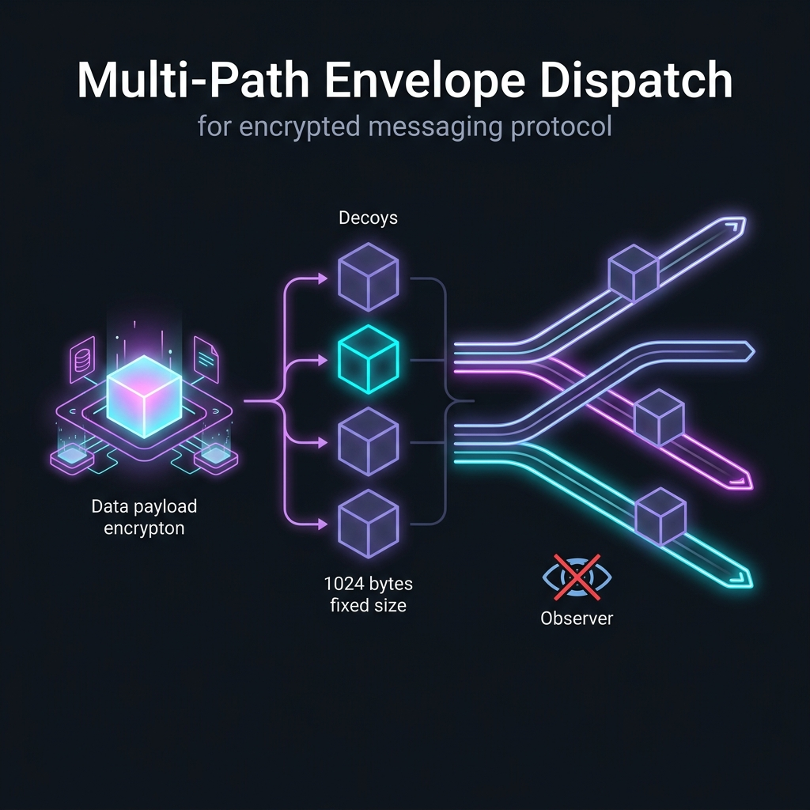
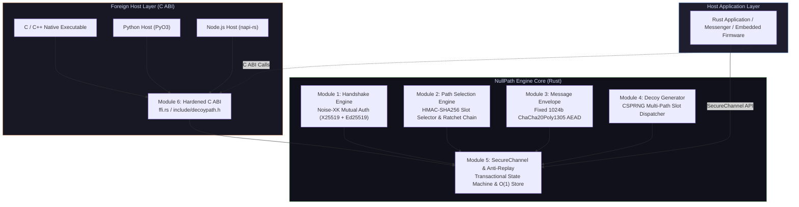
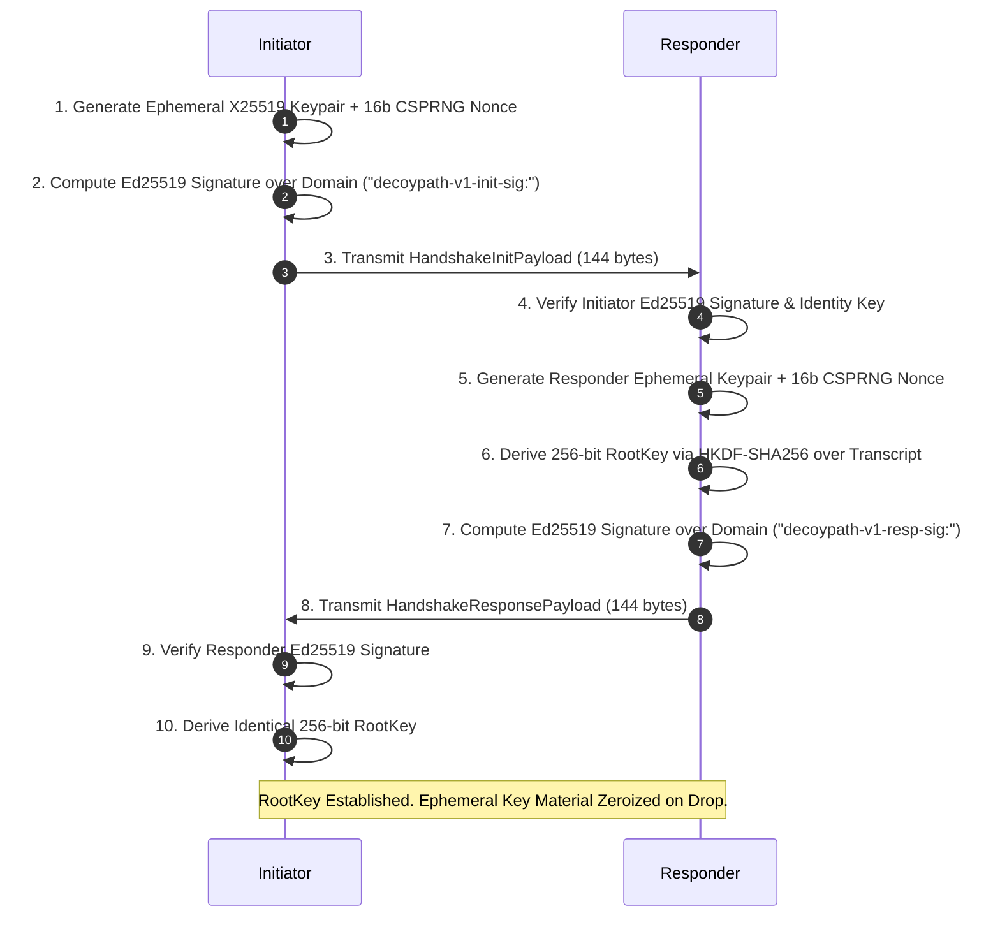
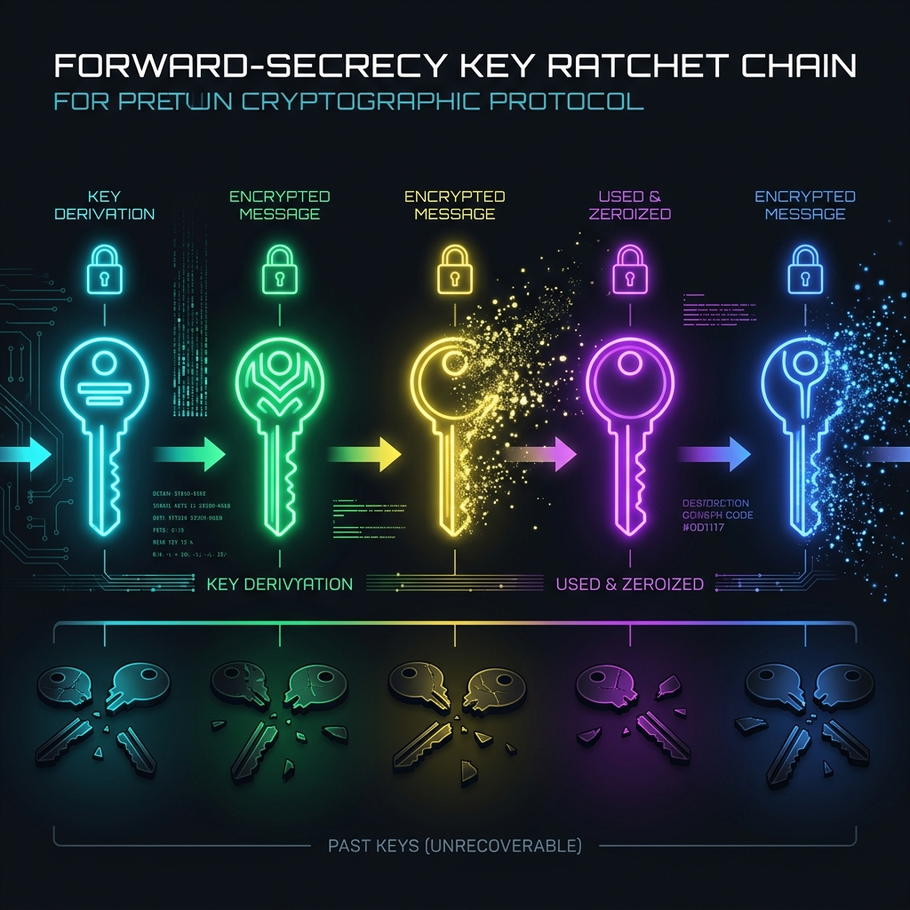

<div align="center">


<br/>

### ⚡ NULLPATH ⚡
**Next-Generation Zero-Trust, Multi-Path Obfuscated Secure Protocol Engine**

*Traffic-Analysis Resistant · Constant-Size Envelopes · Transactional Zero-Mutation State Machine*

---

[](https://www.rust-lang.org)
[](LICENSE)
[](#)
[](#)
[](#security-architecture--scope)
[](#-license)

[Overview](#-overview) ·
[Comparative Matrix](#-protocol-comparative-matrix) ·
[Architecture](#-system-architecture) ·
[Protocol Lifecycle](#-protocol-lifecycle) ·
[Security State Machine](#-transactional-zero-mutation-state-machine) ·
[Usage](#-quickstart--usage) ·
[C ABI Bindings](#-c-abi--foreign-language-bindings)

---

</div>

## 🌌 Overview

Modern secure channels (TLS 1.3, Noise Protocol, Signal) protect **content confidentiality**, but leave **traffic metadata** exposed. Passive adversaries observing encrypted connections can infer communication presence, packet sizes, transmission intervals, and burst patterns — unmasking users and infrastructure without ever breaking a single cipher.

**`NullPath`** is a high-performance cryptographic engine engineered in Rust to neutralize side-channel metadata analysis at the application layer.

```
       WITHOUT NULLPATH (Metadata Leakage)              WITH NULLPATH (Complete Obfuscation)
  ┌────────────────────────────────────────┐     ┌────────────────────────────────────────┐
  │ [User] ──( 128b )────────────────> [A] │     │ [User] ──( 1024b Real Envelope )─> [A] │
  │ [User] ──( 512b )────────────────> [B] │     │ [User] ──( 1024b Decoy Envelope)─> [B] │
  │ (Observer sees size/timing/targets)    │     │ [User] ──( 1024b Decoy Envelope)─> [C] │
  └────────────────────────────────────────┘     │ (Observer sees N identical envelopes)  │
                                                 └────────────────────────────────────────┘
```

### 🔮 Core Security Invariants

| Invariant | Description |
|:----------|:------------|
| 🎭 **Metadata Uniformity** | Every transmission generates $N$ byte-identical 1024-byte envelopes. Real payloads are multiplexed alongside CSPRNG decoy envelopes encrypted under ephemeral keys. |
| 🔁 **Single-Use Forward Ratchet** | Keys are derived on-demand via single-use hash ratchets (`decoypath-v1-ratchet:`) and zeroized upon consumption. Past sessions remain inviolable. |
| ⚡ **Transactional Zero-Mutation** | Forged, corrupt, or out-of-order packets fail authentication in constant time before committing any state mutation. |
| 🧩 **Bounded Memory Execution** | $O(\log N)$ min-key eviction (`BTreeMap`) for skipped ratchet keys (`MAX_SKIPPED_KEYS = 1000`) and $O(1)$ amortized sliding-window anti-replay store (`10,000` capacity, 300s window). |
| 🌉 **Hardened Foreign ABI** | Standard C ABI bindings wrapped in `std::panic::catch_unwind` with strict buffer capacity verification and stack/heap memory zeroization. |

---

## 📊 Protocol Comparative Matrix

<div align="center">

| Security & Architectural Feature | `NullPath` | **TLS 1.3** | **Noise Protocol** | **Signal Protocol** | **Tor / Mixnet** |
|:---------------------------------|:----------:|:-----------:|:------------------:|:-------------------:|:----------------:|
| **Payload Content Confidentiality** | ✅ AEAD | ✅ AEAD | ✅ AEAD | ✅ AEAD | ✅ Onion AEAD |
| **Payload Size Masking** | ✅ Constant (1024b) | ❌ Dynamic | ❌ Dynamic | ❌ Dynamic | ⚠️ Fixed Cells |
| **Decoy Traffic Multiplexing** | ✅ Multi-Path CSPRNG | ❌ None | ❌ None | ❌ None | ⚠️ Cover Traffic |
| **Traffic Metadata Obfuscation** | ✅ Application Layer | ❌ None | ❌ None | ❌ None | ✅ Routing Layer |
| **Single-Use Key Forward Secrecy** | ✅ Hash Ratchet | ✅ Ephemeral DH | ✅ Ephemeral DH | ✅ Double Ratchet | ✅ Circuit Keys |
| **Zero-Mutation Forgery Rejection** | ✅ 5-Step Transactional | ❌ Connection Reset | ❌ Session Fail | ❌ MAC Failure | ❌ Cell Drop |
| **Out-of-Order Packet Processing** | ✅ Bounded Sliding | ❌ Sequential Only | ❌ Sequential Only | ✅ Out-of-Order | ❌ Sequential |
| **Constant-Time Decoy Rejection** | ✅ Equal Time | ❌ N/A | ❌ N/A | ❌ N/A | ⚠️ Variable |
| **C ABI Foreign Embeddability** | ✅ Hardened C ABI | ⚠️ OpenSSL / C | ⚠️ Native C | ⚠️ libsignal | ⚠️ C / Rust Lib |

</div>

---

## 🏗️ System Architecture

<div align="center">

<br/>
<em>Multi-Path Envelope Dispatch — Real payloads are indistinguishable from CSPRNG decoys across all N slots</em>
</div>

<br/>



---

## 🔄 Protocol Lifecycle

### Phase 1 — Transcript-Bound Mutual Authentication Handshake

<div align="center">

<br/>
<em>Dual-signed X25519 Ephemeral DH Exchange with Ed25519 Identity Binding & HKDF-SHA256 Transcript Derivation</em>
</div>

<br/>

Two endpoints holding pre-shared Ed25519 identity keypairs execute an ephemeral X25519 Diffie-Hellman exchange:



---

### Phase 2 — Forward-Secret Ratchet Key Derivation

<div align="center">

<br/>
<em>Single-Use Hash Ratchet Chain — Each key is derived, used once, then irreversibly zeroized. Past keys are unrecoverable.</em>
</div>

<br/>

The ratchet chain derives unique per-message keys from the shared `RootKey` using domain-separated HMAC-SHA256:

```
RootKey ──HMAC──► RatchetKey[0] ──HMAC──► RatchetKey[1] ──HMAC──► RatchetKey[2] ──► ...
                       │                       │                       │
                    [Zeroized]              [Zeroized]              [Zeroized]
                   after use               after use               after use
```

Each `RatchetKey[n]` is:
- Used exactly **once** to seal/open an envelope at sequence `n`
- Immediately **zeroized** in memory after consumption
- **Non-invertible** — compromising `RatchetKey[n]` reveals nothing about `RatchetKey[n-1]`

---

### Phase 3 — Obfuscated Multi-Path Dispatch

Payloads (up to 992 bytes) are sealed inside fixed 1024-byte envelopes and dispatched across $N$ path slots:


---

## 🛡️ Transactional Zero-Mutation State Machine

<div align="center">

<br/>
<em>5-Layer Transactional Defense — Forged packets, replay attacks, and injection attempts are rejected with zero state mutation</em>
</div>

<br/>

Incoming envelope arrays pass through a 5-step transactional pipeline ensuring **zero state mutation** on unauthenticated or forged packets:


### Why This Matters

| Attack Scenario | Traditional Protocol | NullPath Response |
|:----------------|:---------------------|:------------------|
| **Forged packet with claimed seq=500** | Session state advanced to 500, all intermediate keys lost | Zero state mutation. Keys derived read-only, discarded on auth failure. |
| **Replay of successfully processed packet** | Re-accepted or connection reset | `AntiReplayStore` detects duplicate → `ReplayedSequence` error |
| **Packet flood at max skip distance** | Unbounded CPU/memory consumption | Bounded to `MAX_SKIP_WINDOW=1000` derivations, `MAX_SKIPPED_KEYS=1000` storage |
| **Corrupt envelope on valid sequence** | AEAD failure, session may be invalidated | Auth failure → zero mutation → genuine retransmission still succeeds |

---

## 📈 Performance & Complexity Spectrum

```
  Metric / Operation                   Complexity Bounds              Performance Profile
  ──────────────────────────────────────────────────────────────────────────────────────────
  Slot Selection (HMAC-SHA256)         O(1) Constant Time             ~0.4 μs / evaluation
  Envelope AEAD Seal/Open              O(1) Fixed 1024 Bytes          ~1.2 μs / envelope
  Skipped Key Eviction (BTreeMap)      O(log N) Min Key Pop           ~0.05 μs / eviction (N ≤ 1000)
  Anti-Replay Lookup & Insertion       O(1) Amortized Queue           ~0.1 μs / operation
  C ABI Panic Unwind Boundary          O(1) Exception Catch           Zero overhead on happy path
```

---

## 💻 Quickstart & Usage

### 1. Cargo Dependency

Add `decoypath` to your `Cargo.toml`:

```toml
[dependencies]
decoypath = "0.1.0"
```

---

### 2. Complete End-to-End Rust Example

```rust
use decoypath::{
    generate_identity_keypair, InitiatorState, ResponderState, SecureChannel,
};

fn main() -> Result<(), Box<dyn std::error::Error>> {
    // 1. Long-term identity keypairs (pre-exchanged out-of-band)
    let (alice_priv, alice_pub) = generate_identity_keypair();
    let (bob_priv, bob_pub) = generate_identity_keypair();

    // 2. Perform 2-pass Noise-XK Mutual Handshake
    let (alice_state, init_payload) = InitiatorState::initiate(alice_priv, bob_pub);
    let (resp_payload, bob_root_key) =
        ResponderState::respond(&bob_priv, Some(&alice_pub), &init_payload)?;
    let alice_root_key = alice_state.finalize(&resp_payload)?;

    // 3. Initialize Secure Channels across 4 multi-path slots
    let mut alice_channel = SecureChannel::new(alice_root_key, 4);
    let mut bob_channel = SecureChannel::new(bob_root_key, 4);

    // 4. Encrypt and transmit payload with decoy obfuscation
    let message_id = b"msg_001";
    let payload = b"Confidential transmission over NullPath";
    let envelopes = alice_channel.send(payload, message_id)?;

    // envelopes.len() == 4  (1 real + 3 decoys, all 1024 bytes each)

    // 5. Receive, authenticate, and decrypt payload (Sequence = 0)
    let received_payload = bob_channel.receive(&envelopes, 0, message_id)?;

    assert_eq!(received_payload, payload);
    println!("✅ Decrypted: {}", String::from_utf8(received_payload)?);

    Ok(())
}
```

---

## 🌉 C ABI & Foreign Language Bindings

`NullPath` exposes a hardened C ABI header in [`include/decoypath.h`](include/decoypath.h) for embedding in C, C++, Python, Go, Node.js, and any language supporting FFI:

```c
#include "decoypath.h"
#include <stdio.h>

int main(void) {
    // Query library ABI version
    int32_t version = decoypath_abi_version();
    printf("NullPath C ABI Version: %d\n", version);

    // Generate identity keypair into caller-allocated buffers
    uint8_t priv_key[32], pub_key[32];
    if (decoypath_generate_identity_keypair(priv_key, pub_key) == DECOYPATH_OK) {
        printf("Identity keypair generated successfully.\n");
    }

    return 0;
}
```

All `extern "C"` functions are wrapped in `std::panic::catch_unwind` — a Rust panic inside any FFI call returns a `DECOYPATH_ERR_*` code instead of unwinding across the C ABI boundary.

---

## 🔐 Security Architecture & Scope

### In-Scope Threat Mitigations

| Threat Vector | Mitigation Strategy |
|:--------------|:--------------------|
| **Man-in-the-Middle (MitM)** | Dual-signed Ed25519 identity exchange with HKDF-SHA256 transcript binding |
| **Passive Traffic Analysis** | Constant 1024-byte multi-path envelopes + CSPRNG decoy path traffic generation |
| **Replay & Injection Attacks** | Sequence-bound AAD commitment + sliding-window `AntiReplayStore` (10K capacity, 300s window) |
| **Slot Index Guessing** | Deterministic but unpredictable HMAC-SHA256 slot selection keyed by ratchet key + message ID |
| **Retroactive Key Compromise** | Forward-secret single-use hash ratcheting (`decoypath-v1-ratchet:`) with immediate zeroization |
| **State Poisoning via Forgery** | 5-step transactional pipeline ensuring zero state mutation on unauthenticated envelopes |
| **CPU Exhaustion DoS** | Per-packet cost bounded to `MAX_SKIP_WINDOW` (1000) derivations — not eliminated; rate-limiting recommended |
| **FFI Panic UB** | All `extern "C"` functions wrapped in `std::panic::catch_unwind` |

### Out-of-Scope Boundaries

| Boundary | Responsibility |
|:---------|:---------------|
| **C ABI Memory Zeroization** | Plaintext/key bytes copied into caller-allocated buffers (`uint8_t*`) leave Rust's `Zeroize` tracking. Caller must zeroize their own memory. |
| **Endpoint Compromise** | Host malware, process memory dumps, or physical key extraction. |
| **Transport Layer Metadata** | IP routing headers, TCP/UDP ports, and packet timing. NullPath operates at the application protocol layer. |

---

## 🧪 Test Suite

45 tests across 8 test modules covering every security-critical path:

```
  Test Module                    Tests   Coverage Focus
  ───────────────────────────────────────────────────────────────
  test_handshake                 8       Mutual auth, tampering, key isolation, zeroization
  test_channel                   8       In-order, out-of-order, replay, forgery, zero-mutation
  test_envelope                  9       AEAD roundtrip, tamper rejection, padding randomization
  test_path_engine               8       Ratchet chain, slot determinism, distribution uniformity
  test_decoy                     6       Structural indistinguishability, slot placement
  test_anti_replay               3       Duplicate rejection, capacity eviction, fresh acceptance
  test_ffi                       3       ABI version, null pointer rejection, E2E FFI handshake
  compile_tests                  1       Ephemeral key reuse prevention (compile-time)
  ───────────────────────────────────────────────────────────────
  TOTAL                          45      All passing ✅
```

Run the full suite:

```bash
cargo test
```

---

## 🔧 Project Structure

```
NullPath/
├── Cargo.toml                    # Package manifest & dependencies
├── LICENSE                       # Dual MIT / Apache-2.0
├── README.md                     # This document
├── include/
│   └── decoypath.h               # C ABI header for foreign bindings
├── assets/                       # Documentation illustrations
├── src/
│   ├── lib.rs                    # Public API surface & re-exports
│   ├── handshake.rs              # Module 1: Noise-XK mutual authentication
│   ├── path_engine.rs            # Module 2: HMAC slot selection & ratchet chain
│   ├── envelope.rs               # Module 3: Fixed 1024b ChaCha20-Poly1305 AEAD
│   ├── decoy.rs                  # Module 4: CSPRNG multi-path decoy generator
│   ├── channel.rs                # Module 5: SecureChannel state machine
│   ├── anti_replay.rs            # Module 5b: Sliding-window anti-replay store
│   ├── crypto.rs                 # Ephemeral X25519 keypair (move-only)
│   ├── types.rs                  # Wire types, serialization, zeroization
│   ├── errors.rs                 # Granular error taxonomy
│   └── ffi.rs                    # Module 6: Hardened C ABI extern functions
└── tests/
    ├── test_handshake.rs         # Handshake auth & tampering tests
    ├── test_channel.rs           # Channel state machine & attack tests
    ├── test_envelope.rs          # AEAD seal/open & tamper tests
    ├── test_path_engine.rs       # Ratchet & slot selection tests
    ├── test_decoy.rs             # Decoy indistinguishability tests
    ├── test_anti_replay.rs       # Anti-replay store tests
    ├── test_ffi.rs               # FFI boundary tests
    └── compile_tests/            # Compile-time safety tests
        └── ephemeral_key_reuse.rs
```

---

## 🛠️ Cryptographic Stack

| Primitive | Implementation | Purpose |
|:----------|:---------------|:--------|
| **X25519** | `x25519-dalek` | Ephemeral Diffie-Hellman key agreement |
| **Ed25519** | `ed25519-dalek` | Identity authentication & transcript signing |
| **HKDF-SHA256** | `hkdf` + `sha2` | Domain-separated key derivation from DH output |
| **HMAC-SHA256** | `hmac` + `sha2` | Ratchet chain derivation & slot index selection |
| **ChaCha20-Poly1305** | `chacha20poly1305` | Authenticated envelope encryption (AEAD) |
| **CSPRNG** | `rand_core::OsRng` | Nonce, padding, decoy key, and ephemeral key generation |
| **Zeroize** | `zeroize` | Deterministic memory scrubbing of all key material |

All cryptographic primitives use **audited, published Rust crates** — zero hand-rolled crypto, zero `unsafe` blocks in crypto paths.

---

## 📜 License

This project is dual-licensed under:
- **Apache License, Version 2.0** ([LICENSE](LICENSE) or http://www.apache.org/licenses/LICENSE-2.0)
- **MIT License** ([LICENSE](LICENSE) or http://opensource.org/licenses/MIT)

Copyright (c) 2026 **Muhammad Abu Zar Qureshi**

---

<div align="center">

**Built with 🔒 by [Muhammad Abu Zar Qureshi](https://github.com/aimuhammadabuzarqureshi-cloud)**

*Every message you send looks identical to every message you don't.*

</div>
